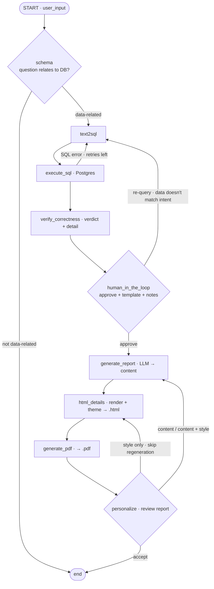

# CLAUDE.md

Context for this project so future sessions don't re-derive scope. Update when scope or architecture changes.

## Project
**LLM Auto-Generate Report** — internship POC @ SCG (doing-by-learning). Generate reports from a database using an LLM, with human-in-the-loop curation and per-user personalization.

**Pipeline:**
```
user prompt -> schema gate -> Text2SQL -> run SQL on Postgres -> verify correctness
-> human-in-the-loop (approve + pick template + notes) -> generate report content
-> Jinja render HTML -> PDF -> personalize (content / style / both) -> END
```

## Scope (locked)
- **Sample DB:** `classicmodels` (Postgres). Source SQL: `/Users/nattawat1409/Desktop/AI_RAG_prod/app/Postgre/classicmodels_postgres.sql` — do NOT auto-copy into the repo, always ask first.
- **4 report templates:** `generic` (ad-hoc fallback) + `sales` / `customer` / `collection_payment`.
- **Deadline:** whole POC done by **22 Jul 2026** (timeline 1–22 Jul, 3 weeks).
- **UI:** Gradio (in progress — replaces `streamlit_app.py`, which is superseded). **LLM:** LiteLLM proxy (OpenAI-compatible) -> Gemini 2.5 Flash via `langchain_openai.ChatOpenAI`. **Orchestration:** LangGraph.
- **No FastAPI for the POC** — Gradio imports and calls the compiled graph in-process. `app/api/` is a stub kept for future work only.

## Tech stack
- Python + Gradio (UI), managed with `uv` (pyproject.toml)
- Postgres 16 + pgAdmin (via Docker, in `app/Postgre/`)
- SQLAlchemy + psycopg2 — app connects as role `normal_user` (read-only)
- langchain-openai (`ChatOpenAI`) + LangGraph -> LiteLLM proxy -> Gemini 2.5 Flash
- Jinja2 (HTML templates) + WeasyPrint (HTML->PDF)

**LLM setup (via LiteLLM):**
```python
from langchain_openai import ChatOpenAI
import os

llm = ChatOpenAI(
    model="google/gemini-2.5-flash",
    base_url=os.environ["LITELLM_URL"],
    api_key=os.environ["API_KEY"],
)
```
env vars: `LITELLM_URL`, `API_KEY`, `DATABASE_URL` (read-only), `ADMIN_DATABASE_URL` (full).
`llm/client.py` exposes `llm` as an instance. Nodes that need determinism do
`llm.model_copy(update={"temperature": 0})` locally (text2sql, generate_report).

## Repo structure
```
app/
├── .env                          # secrets (gitignored)
├── config.py                     # loads .env
├── graph.py                      # LangGraph wiring + compile  ← entry point
├── streamlit_app.py              # SUPERSEDED by Gradio, do not maintain
├── llm/client.py                 # ChatOpenAI -> LiteLLM -> Gemini (exposes `llm`)
├── db/{engine,schema}.py         # SQLAlchemy engine (read-only) + schema introspection
├── models/states/state.py        # the LangGraph state TypedDict
├── nodes/                        # one file per graph node
│   ├── schema.py                 #   gate: is the question DB-related?
│   ├── text2sql.py               #   NL -> SQL (structured output + few-shot rules)
│   ├── executeSQL.py             #   run SQL, self-retry loop on error
│   ├── verify_correctness.py     #   LLM verdict + report-ready detail
│   ├── human_in_the_loop.py      #   human: approve + template + notes | re-query
│   ├── generate_report.py        #   rows -> Pydantic content per template
│   ├── html_details.py           #   Jinja render + apply theme_*, write .html
│   ├── generate_pdf.py           #   WeasyPrint -> .pdf
│   └── personalize.py            #   human: content / style / both | accept
├── report/templates/             # base.html + generic/sales/customer/collection_payment
├── api/                          # FastAPI stub — NOT used by the POC
├── ui/                           # Gradio UI (to build — see docs/gradio_ui_spec.md)
├── docs/
│   ├── graph_draft.md            # pipeline design
│   └── gradio_ui_spec.md         # UI implementation spec
├── evalution_RAG.ipynb           # Text2SQL eval harness (15 ground-truth cases)
├── test_graph.py                 # scratch (LangChain tutorial, unrelated)
├── test_personalize_chain.py     # manual chain test: generate_report -> html -> pdf -> personalize
└── Postgre/                      # docker-compose.yml, pgadmin4/, postgres/initdb.d/
output/
├── html_output/{,after_personalize/}
└── pdf_output/{,after_personalize/}
```

## Commands
```bash
# Database (run from app/Postgre/) — auto-pulls image
cd app/Postgre
docker compose up -d             # postgres:5432, pgAdmin:localhost:5050
docker compose down -v           # remove volumes (required to re-seed .sql)

# App (uv) — run -m modules from INSIDE app/ (app/ is the source root)
cd app
uv run -m graph                  # full pipeline, CLI
uv run -m nodes.text2sql         # any node standalone (each has a __main__ smoke test)
uv run -m test_personalize_chain # generate_report -> html_details -> generate_pdf -> personalize
```
- Seed `.sql` auto-loads **only on first start** (empty volume). After editing SQL, `down -v` first.
- Mounting a host file that does not exist makes Docker create a **directory** at that path — create the file BEFORE `up`.
- pgAdmin login: `pgadmin4@email.com` / `admin`. servers.json auto-imports only on first pgadmin init.

## classicmodels schema (8 tables)
```
productlines(productLine PK, textDescription, htmlDescription, image)
products(productCode PK, productName, productLine FK, productScale, productVendor,
         productDescription, quantityInStock, buyPrice, MSRP)
offices(officeCode PK, city, phone, addressLine1/2, state, country, postalCode, territory)
employees(employeeNumber PK, lastName, firstName, extension, email, officeCode FK,
          reportsTo FK->employees, jobTitle)
customers(customerNumber PK, customerName, contactLast/FirstName, phone, address..., city,
          state, postalCode, country, salesRepEmployeeNumber FK->employees, creditLimit)
payments(customerNumber PK/FK, checkNumber PK, paymentDate, amount)
orders(orderNumber PK, orderDate, requiredDate, shippedDate, status, comments, customerNumber FK)
orderdetails(orderNumber PK/FK, productCode PK/FK, quantityOrdered, priceEach, orderLineNumber)
```
Relations: productlines->products->orderdetails->orders->customers->payments; employees->offices; customers->employees (salesRep).
Postgres folds unquoted identifiers to **lowercase** — write `customernumber`, not `customerNumber`, in SQL.

## Conventions / guardrails
- **Imports:** `app/` is the source root — import bare (`from llm.client import llm`, `from nodes.text2sql import ...`), NEVER `from app.xxx`. Run modules from inside `app/`. Do not add `app/__init__.py`.
- **Always call the LLM via `llm.with_structured_output(PydanticModel)`** (user's standard pattern). If Gemini via LiteLLM errors, try `method="json_mode"` or `"function_calling"`.
- **Two-layer guardrail:** (1) app layer parses SQL, (2) DB layer — app connects via role `normal_user` (SELECT-only, password `user`), not superuser. Role is created automatically by `app/Postgre/postgres/docker-entrypoint-initdb.d/zz_readonly_user.sql`. App uses `DATABASE_URL` (normal_user); pgAdmin/admin uses `postgres`/`admin`. docker-compose mounts the whole `docker-entrypoint-initdb.d/` dir (auto-loads all .sql in name order).
- The raw LLM "knows" classicmodels table names from training data (it's a famous sample DB) — do NOT rely on that. Always inject the real introspected schema; real data (counts/sums) requires executing SQL.
- **Text2SQL prompt rules that were added because they actually failed:** no `SELECT COUNT(*)` (count by PK); aggregate each one-to-many relationship in its **own CTE** before joining (raw joins of `orderdetails` + `payments` cause row explosion → silently wrong SUMs); always put a space between a table name and its alias (the LLM emitted `orderdetailsod`).
- **`generate_report` never handles style; `html_details` never handles content.** Style lives only in `theme_*` state keys applied at render time.
- **Jinja default filter needs the boolean arg:** `{{ theme_x | default('#fallback', true) }}` — without `true`, a `None` value renders the literal string "None".
- Personalize (POC) = few-shot from reports the user edited (no fine-tuning).
- docker-compose uses the user's format: named volumes, `${ENV:-default}`, network `postgres`, volume `postgres_data:/var/lib/postgresql`.

## LangGraph flow
Full design: `app/docs/graph_draft.md`. Summary:

Nodes: `START` -> `schema` (gate) -> `text2sql` -> `execute_sql` -> `verify_correctness` -> `human_in_the_loop` -> `generate_report` -> `html_details` -> `generate_pdf` -> `personalize` -> `END`.

Self-routing nodes (return `Command(goto=...)`): `schema`, `execute_sql`, `human_in_the_loop`, `personalize`. The rest are static edges.



**Three layers catch three different failure classes** — this separation is the point of the design:
- `execute_sql` retry loop → **syntax/runtime errors** (LLM fixes its own SQL, max 2 retries)
- `verify_correctness` → **LLM verdict** on whether the rows answer the question (informational, never blocks)
- `human_in_the_loop` → **semantic mismatch** (the SQL ran fine and returned data, but it's not what the human asked for). Nothing else can catch this.

## Known gap — blocks the Gradio UI
`graph.py` compiles **without a checkpointer**, and `human_in_the_loop` / `personalize` block on `input()`. That works for the CLI but cannot serve a web UI. Phase 0 of `docs/gradio_ui_spec.md`: swap both to `interrupt()` and compile with `SqliteSaver`.

## Links
- Notion timeline (17 tasks, sub-page under "Research topic"): https://app.notion.com/p/c6b20d93fbb5475f927f165e69859bc5
- Notion — Style Personalization plan: https://app.notion.com/p/3995254118cd8157bf61f2e9316c3ec4
- Notion — User Memory (future, post-POC): https://app.notion.com/p/39c5254118cd81e3aa45de706d92ba0b
