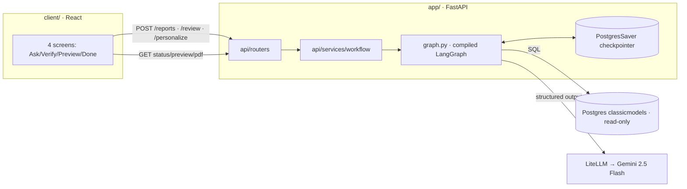

# CLAUDE.md

Context for this project so future sessions don't re-derive scope. Update when scope or architecture changes.

## Project
**LLM Auto-Generate Report** — internship POC @ SCG (doing-by-learning). Turn a natural-language
question into a formatted business report, with human-in-the-loop curation and per-user
personalization.

**Two branches, two UIs:**
- **`v2` = the shipped POC** — Gradio UI calling the compiled graph in-process. This is the
  deadline deliverable (22 Jul 2026).
- **`prod` = this branch — future/production design**, built by adding a React frontend and a
  real FastAPI surface **on top of the existing `app/` codebase** (not a rewrite). If it doesn't
  land by the deadline, `v2` ships and this stands as the documented direction to keep building.

**Pipeline (unchanged across branches):**
```
user prompt -> schema gate -> Text2SQL -> run SQL on Postgres -> verify correctness
-> human-in-the-loop (approve + pick template + notes) -> generate report content
-> Jinja render HTML -> PDF -> personalize (content / style / both) -> END
```

## Scope (locked)
- **Sample DB:** `classicmodels` (Postgres). Source SQL lives outside the repo — always ask before copying in.
- **4 report templates:** `generic` (ad-hoc fallback) + `sales` / `customer` / `collection_payment`.
- **Deadline:** POC done by **22 Jul 2026**. `prod` is best-effort beyond that.
- **UI:** React (`client/`, new on this branch). **API:** FastAPI (`app/api/`, expanded from the
  existing stub). **LLM:** LiteLLM proxy (OpenAI-compatible) -> Gemini 2.5 Flash via
  `langchain_openai.ChatOpenAI`. **Orchestration:** LangGraph.

## What actually changes vs. what stays put
This branch **adds to** the existing layout — it does not restructure it. `pyproject.toml` /
`uv.lock` already live at the repo root, so no `backend/` folder or file moves are needed.

| | Status |
|---|---|
| `client/` (React, Vite+TS) | ★ new, sibling of `app/` at repo root |
| `app/api/{deps,errors,routers,services,schemas}` | ★ new — fleshes out the existing (empty) `app/api/main.py` stub |
| `app/__init__.py` | ★ new (already added, empty) — makes `app/` a conventional package |
| import style inside `app/` | 🔧 changing — bare (`from nodes.x import`) → `from app.nodes.x import`, to work consistently once `app/__init__.py` exists. **This must be applied to every file under `app/` in the same pass** — mixing bare and `app.`-prefixed imports of the same module in one process double-loads it (breaks shared state, e.g. the `llm` singleton in `llm/client.py`). |
| `app/nodes/`, `app/db/`, `app/llm/`, `app/models/`, `app/report/`, `app/graph.py`, `app/docs/`, `app/Postgre/`, `app/Evaluate/` | ✅ unchanged in content — only the import statements inside them move |
| `output/`, root `main.py`, `pyproject.toml`, `uv.lock` | ✅ unchanged |

No `backend/` or `infra/` folders. No moving `state.py`. No new `graph/builder.py` — `app/graph.py`
keeps building the graph; it just gains a checkpointer arg on `.compile(...)`.

## System architecture (prod)
`client/` (React) sits next to `app/` (FastAPI + LangGraph) at the repo root — separate
toolchains (Node vs. Python), so they get separate Dockerfiles later even though they ship in one
`docker-compose.yml` for now. The only real boundary between them is the HTTP API.

React talks to FastAPI over request/response + polling (no SSE/WebSocket yet — can be added later
without changing the run/resume contract). FastAPI owns the compiled LangGraph and its
checkpointer; the graph reaches Postgres (read-only) for data and LiteLLM->Gemini for the LLM.



## Architecture decision — LangGraph in-process (not a separate service)

`app/api/services/workflow.py` imports the compiled graph directly and calls it via
`run_in_threadpool` — it does **not** call out to a separate LangGraph service/process.

**Why:** all session state already lives in `PostgresSaver`, not in FastAPI's memory — so
scaling FastAPI to multiple workers/replicas doesn't require a separate LangGraph service to
keep sessions consistent. Splitting it out now would add deployment/network complexity with no
current benefit (single app, single team, no LLM load high enough to need independent scaling).

**Trade-off table:**

| | In-process (current choice) | Separate service |
|---|---|---|
| Complexity to start | Low — one codebase, one deploy | High — inter-service API, network/timeout handling |
| Deploy | 1 container | 2+ containers |
| Scale LangGraph independently of HTTP layer | ❌ | ✅ |
| Latency | Lower (in-process call) | Higher (network hop) |
| Session consistency across instances | ✅ via `PostgresSaver` either way | ✅ same |

**Must-do because it's in-process:** `graph.invoke(...)` is synchronous and blocks the event
loop while waiting on the LLM. Every call site in `api/services/workflow.py` must go through
`starlette.concurrency.run_in_threadpool`:
```python
result = await run_in_threadpool(graph.invoke, payload, config=thread_config)
```

**Revisit this decision if:** another team/app needs to call the same pipeline, or LLM traffic
grows enough that it needs to scale independently of the HTTP layer. Until then, don't split it.

## Tech stack
- **Frontend:** React + Vite + TypeScript (`client/`)
- **Backend:** Python + FastAPI, managed with `uv` (root `pyproject.toml`, unchanged)
- **Orchestration:** LangGraph (+ LangChain) — served in-process, with `PostgresSaver` checkpointer
- **DB:** Postgres 16 + pgAdmin (Docker, `app/Postgre/`, unchanged), SQLAlchemy + psycopg2, app
  connects as read-only role `normal_user`
- **LLM:** langchain-openai (`ChatOpenAI`) -> LiteLLM proxy -> Gemini 2.5 Flash
- **Report:** Jinja2 (HTML) + WeasyPrint (HTML->PDF)

**LLM setup (via LiteLLM):**
```python
from langchain_openai import ChatOpenAI
import os
llm = ChatOpenAI(
    model="google/gemini-2.5-flash",
    base_url=os.environ["LITELLM_URL"],
    api_key=os.environ["API_KEY"],
)
```
env: `LITELLM_URL`, `API_KEY`, `DATABASE_URL` (read-only), `ADMIN_DATABASE_URL` (full),
`CHECKPOINT_DATABASE_URL` (new, for `PostgresSaver`). `llm/client.py` exposes `llm` as an
instance; deterministic nodes do `llm.model_copy(update={"temperature": 0})` locally.

## Directory structure
```
LLM-Auto-Generate-report/
├── client/                     # ★ new — React (Vite + TS)
│   └── src/{api,hooks,components,screens}/   # api client · useReportSession · panels · 4 screens
├── app/
│   ├── __init__.py             # ★ new (empty)
│   ├── config.py  graph.py     # unchanged (graph.py gains checkpointer on compile())
│   ├── api/
│   │   ├── main.py             # existing stub → grows into the FastAPI app factory
│   │   ├── deps.py  errors.py  # ★ new — DI providers · exception→HTTP handlers
│   │   ├── routers/{reports,metadata,health}.py     # ★ new
│   │   ├── services/{workflow,session,artifacts}.py # ★ new
│   │   └── schemas/{reports,common}.py               # ★ new — API DTOs, decoupled from graph state
│   ├── nodes/ db/ llm/ models/ report/   # unchanged content, imports updated to `from app.x`
│   ├── docs/                   # graph_draft.md, gradio_ui_spec.md (POC ref), + api_design.md (new)
│   └── Postgre/  Evaluate/     # unchanged
├── main.py  pyproject.toml  uv.lock   # unchanged, at repo root
├── output/                     # unchanged
└── CLAUDE.md  README.md
```

## API service responsibilities
Organized **by concern (routers → services → schemas), not by graph node** — the API exposes a
run→pause→resume *lifecycle*, not individual nodes. The two `interrupt()` points are resume
steps, not separate endpoints per node.

| Endpoint | Graph mapping | Role |
|---|---|---|
| `POST /reports` | START→schema→text2sql→execute→verify → ⏸HITL | start a session; returns `{session_id, status, payload}` |
| `POST /reports/{id}/review` | resume `human_in_the_loop` | approve+template+notes \| requery+feedback |
| `POST /reports/{id}/personalize` | resume `personalize` | accept \| content \| style |
| `GET /reports/{id}` | `graph.get_state()` | status + current step + interrupt payload (poll) |
| `GET /reports/{id}/preview` | `html_detail` | rendered HTML |
| `GET /reports/{id}/pdf` | `generate_pdf` | PDF download |
| `GET /schema` · `GET /templates` | db introspection · static | metadata for the UI |

| Module | Role |
|---|---|
| `api/routers/*` | thin HTTP: validate DTO → call service → shape response |
| `api/services/workflow.py` | start/resume the compiled graph via `run_in_threadpool`; translate `__interrupt__` ↔ API status; **only module allowed to import `app.graph`** |
| `api/services/session.py` | thread_id lifecycle; read state via checkpointer; locate current interrupt |
| `api/services/artifacts.py` | resolve + stream html/pdf for a session |
| `api/schemas/*` | Pydantic DTOs = the contract; decouple frontend from the internal `state` TypedDict |
| `api/errors.py` | domain exception → HTTP code; catch-all, no stack-trace leaks |

**Checkpointer:** `PostgresSaver` (concurrent sessions, survives restart) — set on
`app/graph.py`'s `builder.compile(checkpointer=...)`. `thread_id` = one report session, generated
per `POST /reports`, held client-side; all graph state lives server-side.

**Streaming (future seam):** progress is polled via `GET /reports/{id}` today. An SSE
`GET /reports/{id}/events` can be added later without changing the run/resume contract.

## classicmodels schema (8 tables)
```
productlines(productLine PK, textDescription, htmlDescription, image)
products(productCode PK, productName, productLine FK, productScale, productVendor,
         productDescription, quantityInStock, buyPrice, MSRP)
offices(officeCode PK, city, phone, addressLine1/2, state, country, postalCode, territory)
employees(employeeNumber PK, lastName, firstName, extension, email, officeCode FK,
          reportsTo FK->employees, jobTitle)
customers(customerNumber PK, customerName, contactLast/FirstName, phone, address..., city,
          state, postalCode, country, salesRepEmployeeNumber FK->employees, creditLimit)
payments(customerNumber PK/FK, checkNumber PK, paymentDate, amount)
orders(orderNumber PK, orderDate, requiredDate, shippedDate, status, comments, customerNumber FK)
orderdetails(orderNumber PK/FK, productCode PK/FK, quantityOrdered, priceEach, orderLineNumber)
```
Relations: productlines->products->orderdetails->orders->customers->payments; employees->offices;
customers->employees (salesRep).
Postgres folds unquoted identifiers to **lowercase** — write `customernumber`, not `customerNumber`.

## Conventions / guardrails
- **Imports (prod — CHANGED from v2):** `app/` is now a **conventional package**
  (`app/__init__.py` exists). Import absolute: `from app.nodes.text2sql import ...`,
  `from app.llm.client import llm`. Run the API from the **repo root**
  (`uvicorn app.api.main:app`). ⚠️ This reverses v2's rule (bare `from nodes.x`, no
  `__init__.py`) — don't mix the two conventions inside one running process.
- **Always call the LLM via `llm.with_structured_output(PydanticModel)`.** If Gemini via LiteLLM
  errors, try `method="json_mode"` or `"function_calling"`.
- **Two-layer SQL guardrail:** (1) app parses SQL, (2) DB role `normal_user` is SELECT-only
  (created by `app/Postgre/postgres/docker-entrypoint-initdb.d/zz_readonly_user.sql`).
- **Never trust the LLM's built-in knowledge of classicmodels** — always inject the real
  introspected schema; real counts/sums require executing SQL.
- **Text2SQL prompt rules (came from real bugs):** no `SELECT COUNT(*)` (count by PK); aggregate
  each one-to-many relationship in its **own CTE** before joining (raw joins of `orderdetails` +
  `payments` explode rows → wrong SUMs); always a space between a table name and its alias.
- **`generate_report` never handles style; `html_details` never handles content.** Style lives
  only in `theme_*` state keys applied at render time.
- **Jinja default filter needs the boolean arg:** `{{ theme_x | default('#fallback', true) }}`.
- **API never leaks the internal `state` TypedDict** — translate to/from `api/schemas` DTOs.
- **`api/services/workflow.py` is the only module allowed to import `app.graph`**, and must call
  it through `run_in_threadpool` (see "Architecture decision" above).
- Personalize (POC) = few-shot from reports the user edited (no fine-tuning).

## LangGraph flow
Full design: `app/docs/graph_draft.md`. Summary:

Nodes: `START` -> `schema` (gate) -> `text2sql` -> `execute_sql` -> `verify_correctness` ->
`human_in_the_loop` -> `generate_report` -> `html_details` -> `generate_pdf` -> `personalize` -> `END`.

Self-routing nodes (return `Command(goto=...)`): `schema`, `execute_sql`, `human_in_the_loop`,
`personalize`. The rest are static edges. Both human nodes use `interrupt()`; the graph is
compiled with a checkpointer (see "API service responsibilities" above).


**Three layers catch three failure classes** (the point of the design):
- `execute_sql` retry loop → syntax/runtime errors (LLM fixes its own SQL, max 2 retries)
- `verify_correctness` → LLM verdict on whether rows answer the question (informational, never blocks)
- `human_in_the_loop` → semantic mismatch (SQL ran, returned data, but not what was asked).

## Notes for future changes
- **`prod` inherits node logic from `v2`** — when a node's behavior changes, decide whether it
  should land on both branches. `app/api/` and `client/` are prod-only.
- The mermaid graph above is the source of truth for the pipeline — **don't restructure it**;
  only add/modify a line when a node or edge genuinely changes.
- To split into a scaled deployment later: promote `client/` to its own static host and `app/`
  to its own service — the HTTP contract already isolates them; no further folder moves needed.
- Move `output/` artifacts to object storage before real multi-user use.

## Housekeeping (unrelated to this restructure, flagged separately)
- `venv/` is currently committed (~18.7k files) despite being in `.gitignore` — was committed
  before the ignore rule existed. Should be `git rm -r --cached venv/` in its own commit.
- `app/.env` was committed to `origin/prod` — rotate any real credentials it contains, then
  remove from tracking (`git rm --cached app/.env`); removing from git **history** is a separate,
  more invasive step (`git filter-repo` + force-push) — do not do this without confirming first.

## Links
- Notion timeline: https://app.notion.com/p/c6b20d93fbb5475f927f165e69859bc5
- Notion — Style Personalization plan: https://app.notion.com/p/3995254118cd8157bf61f2e9316c3ec4
- Notion — User Memory (future, post-POC): https://app.notion.com/p/39c5254118cd81e3aa45de706d92ba0b