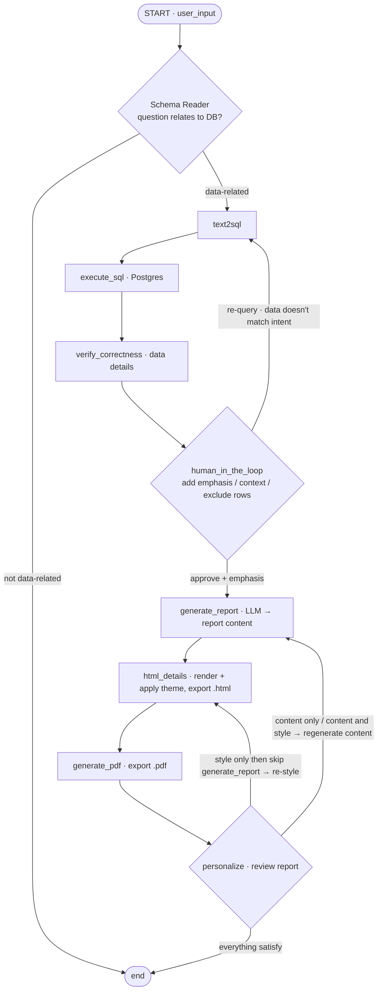

# LLM Auto-Generate Report

An internship POC that turns a natural-language question into a formatted business report.
It converts the question to SQL, runs it against a PostgreSQL database, lets a human review and
curate the data, then generates an HTML/PDF report — with a human-in-the-loop and per-user
personalization step. Built with **LangGraph**.

## Pipeline

```
user prompt → Text2SQL → run SQL (Postgres, read-only) → verify correctness
→ human-in-the-loop (curate) → generate report → HTML → PDF → personalize (content / style)
```

## Graph structure



## Key features

- **Text2SQL** with schema injection + safety guardrails (read-only, always `LIMIT`).
- **Two-layer guardrail:** app parses the SQL, and the DB connects as a `SELECT`-only role.
- **Human-in-the-loop** as a curator — approve, re-query on semantic mismatch, or add emphasis/context.
- **3 report templates** (Sales / Customer / Collection-payment) + a generic fallback, rendered with Jinja2.
- **Personalization** — refine content, restyle (colors / font size), or both, in a review loop.

## Tech stack

- Python + Streamlit (UI), managed with `uv`
- PostgreSQL 16 + pgAdmin (Docker)
- LangGraph + `langchain-openai` (`ChatOpenAI`) → LiteLLM proxy → Gemini 2.5 Flash
- SQLAlchemy + psycopg2 · Jinja2 (HTML) · WeasyPrint (PDF)

## Sample database

[`classicmodels`](https://www.mysqltutorial.org/mysql-sample-database.aspx) — a classic model-car
retailer schema (customers, orders, orderdetails, products, payments, employees, offices).

## Getting started

```bash
# 1. Database (from app/Postgre/) — auto-loads the seed on first start
cd app/Postgre
docker compose up -d          # Postgres :5432 · pgAdmin :localhost:5050

# 2. App
cd ..                         # into app/
cp .env.example .env          # then fill in LITELLM_URL / API_KEY / DATABASE_URL
uv sync
uv run -m graph               # run the full pipeline from the CLI
```

> Note: `app/` is the source root — run modules from inside it. WeasyPrint needs native libs
> (`brew install weasyprint` on macOS).

## Project structure

```
app/
├── graph.py            # LangGraph wiring (entry point)
├── config.py           # loads .env
├── llm/                # ChatOpenAI client (LiteLLM → Gemini)
├── db/                 # SQLAlchemy engine + schema introspection
├── nodes/              # schema, text2sql, execute_sql, verify_correctness,
│                       #   human_in_the_loop, generate_report, html_details,
│                       #   generate_pdf, personalize
├── models/states/      # LangGraph state schema
├── report/templates/   # Jinja2 templates (base + 4 formats)
└── Postgre/            # docker-compose, pgAdmin, seed SQL
output/                 # generated HTML/PDF
```

## Status

DATA AI Engineer Internship @ SCG 
for POC — work in progress.
