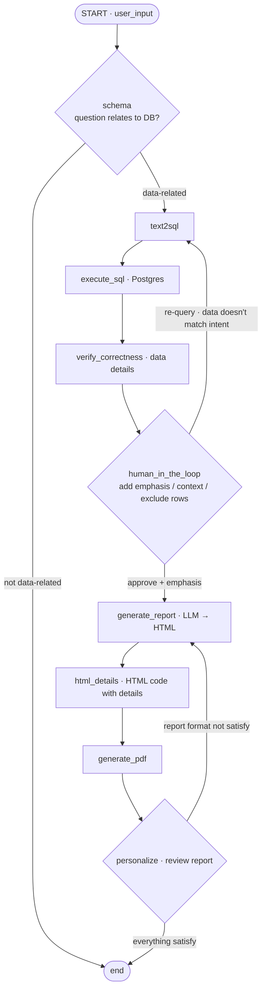

# LLM-Auto-Generate-report
LLM with autogenerate report to get personalize from user to integrate with Human in the Loop.

## AI Auto Generate Report : Graph Structure ## 

```mermaid
flowchart TD
    START([START · user_input]) --> SCHEMA{schema<br/>question relates to DB?}
    SCHEMA -->|not data-related| DONE([end])
    SCHEMA -->|data-related| T2S[text2sql]
    T2S --> EXEC[execute_sql · Postgres]
    EXEC --> VERIFY[verify_correctness · data details]
    VERIFY --> HITL{human_in_the_loop<br/>add emphasis / context / exclude rows}
    HITL -->|re-query · data doesn't match intent| T2S
    HITL -->|approve + emphasis| GEN[generate_report · LLM → HTML]
    GEN --> HTMLD[html_details · HTML code with details]
    HTMLD --> PDF[generate_pdf]
    PDF --> PERS{personalize · review report}
    PERS -->|report format not satisfy| GEN
    PERS -->|everything satisfy| DONE
```
