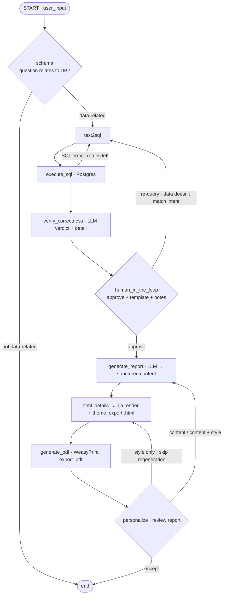

# LangGraph pipeline — design

The compiled graph lives in `app/graph.py`. Nodes live in `app/nodes/`, the shared state
schema in `app/models/states/state.py`.

## Flow



## Routing

Three nodes route themselves by returning `Command(goto=...)`; the rest are static edges.

| Node | Type | Targets |
|---|---|---|
| `schema` | gate | `text2sql` \| `END` |
| `execute_sql` | self-retry | `verify_correctness` \| `text2sql` (on SQL error, max 2 retries) |
| `human_in_the_loop` | human decision | `generate_report` \| `text2sql` |
| `personalize` | human decision | `generate_report` \| `html_details` \| `END` |

## Node responsibilities

| Node | LLM? | What it does |
|---|---|---|
| `schema` | ✅ | Gate: can the question be answered from the introspected schema? Sets `is_question_relate`. |
| `text2sql` | ✅ | NL → PostgreSQL via `with_structured_output(Text2SQLOutput)`. Injects the real schema + few-shot rules (no `COUNT(*)`, CTE-per-relationship to avoid row explosion, space before aliases). Folds in `requery_feedback` when present. |
| `execute_sql` | ❌ | Runs the SQL as read-only `normal_user`. On `SQLAlchemyError`, feeds the DB error back to `text2sql` (self-correction) up to `MAX_SQL_RETRIES = 2`, then gives up honestly with `execute_error` set. |
| `verify_correctness` | ✅ | Deterministic check first (execution error → fail fast, no LLM). Otherwise asks the LLM whether the rows actually answer the question. Produces `is_correct_verify_correctness` (bool) + `detail_verify_correctness` (report-ready prose). **Informational only — never blocks.** |
| `human_in_the_loop` | ❌ | Human curator: approve (+ pick one of 4 templates, + optional emphasis/context notes) or re-query with feedback. |
| `generate_report` | ✅ | Shapes the rows into the Pydantic schema matching the chosen template. Folds in `human_notes` and, on a personalize pass, `personalize_report` feedback. **Never handles style.** |
| `html_details` | ❌ | Jinja renders the structured content into `report/templates/{report_type}.html` and applies `theme_*` overrides. Writes `.html`. |
| `generate_pdf` | ❌ | WeasyPrint HTML → PDF. |
| `personalize` | ✅ | Proposes 3 options, then classifies the user's free text as `content` / `style` / `content and style` and routes accordingly. |

## The two human decision points

**`human_in_the_loop`** — a *curator*, not an approve/reject gate. The human adds what the
database cannot know:
- **report template** — which of the 4 formats to render
- **emphasis / context notes** (`human_notes`) — what to highlight, business context used for
  causal claims in the narrative
- **re-query feedback** (`requery_feedback`) — when the SQL is *valid and ran* but answers the
  wrong question (semantic mismatch; syntax/safety errors are already handled by the
  `execute_sql` retry loop before this point)

**`personalize`** — reviews the finished report and routes 3 ways:
- **style only** → `html_details`, skipping `generate_report` entirely (content is reused,
  only `theme_*` changes) — cheap, deterministic, no LLM regeneration
- **content / content + style** → `generate_report` with `personalize_report` feedback
- **accept** → END

## Report templates

`report/templates/` — `base.html` (shared layout + themeable CSS) plus four formats:

| `report_type` | Template | Shape |
|---|---|---|
| `generic` | `generic.html` | fallback for ad-hoc queries: title, summary, KPI cards, arbitrary tables, narrative sections |
| `sales` | `sales.html` | revenue KPIs, monthly, by product line, top products, by sales rep |
| `customer` | `customer.html` | one customer: profile, purchase/payment KPIs, orders, payments |
| `collection_payment` | `collection_payment.html` | billed vs collected KPIs, per-customer outstanding rows with paid/outstanding badge |

Each `report_type` maps to a Pydantic schema in `generate_report.py` whose fields match the
template's variables exactly.

## Style personalization

`theme_text_color`, `theme_header_color`, `theme_footer_color`, `theme_font_size` live in
state and are injected into the Jinja context by `html_details`. `base.html` reads them with
`{{ theme_x | default('#fallback', true) }}` — the `true` second arg is required so `None`
falls back instead of rendering the string "None".

Style is applied **only** in `html_details`. `generate_report` has no style fields by design.

## Outputs

```
output/html_output/                    # first-pass HTML
output/html_output/after_personalize/  # personalize-pass HTML
output/pdf_output/                     # PDFs (mirrors the same split)
```
Selected by the `is_after_personalize` flag set by `generate_report` / `personalize`.

## Known gap — no checkpointer yet

`build_graph()` currently ends with `builder.compile()` and the two human nodes block on
`input()`. That works for the CLI (`cd app && uv run -m graph`) but **cannot support a web UI**.

To serve the graph from Gradio, both human nodes must use `interrupt()` and the graph must be
compiled with a checkpointer. See `docs/gradio_ui_spec.md` §3.
