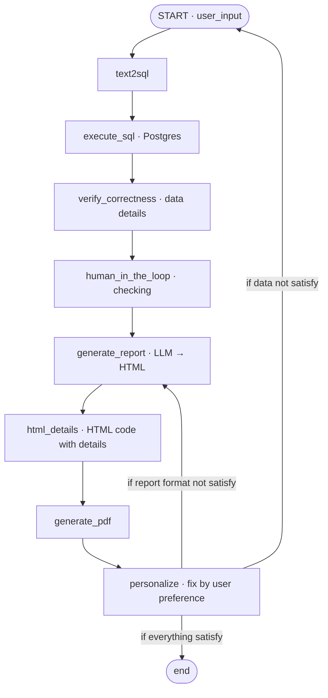

```mermaid
flowchart TD
    START([START · user_input]) --> T2S[text2sql]
    T2S --> EXEC[execute_sql · Postgres]
    EXEC --> VERIFY[verify_correctness · data details]
    VERIFY --> HITL[human_in_the_loop · checking]
    HITL --> GEN[generate_report · LLM → HTML]
    GEN --> HTMLD[html_details · HTML code with details]
    HTMLD --> PDF[generate_pdf]
    PDF --> PERS[personalize · fix by user preference]
    PERS -->|if data not satisfy| START
    PERS -->|if report format not satisfy| GEN
    PERS -->|if everything satisfy| DONE([end])
```