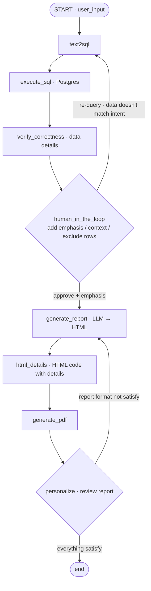

```mermaid
flowchart TD
    START([START · user_input]) --> T2S[text2sql]
    T2S --> EXEC[execute_sql · Postgres]
    EXEC --> VERIFY[verify_correctness · data details]
    VERIFY --> HITL{human_in_the_loop<br/>add emphasis / context / exclude rows}
    HITL -->|approve + emphasis| GEN[generate_report · LLM → HTML]
    HITL -->|re-query · data doesn't match intent| T2S
    GEN --> HTMLD[html_details · HTML code with details]
    HTMLD --> PDF[generate_pdf]
    PDF --> PERS{personalize · review report}
    PERS -->|report format not satisfy| GEN
    PERS -->|everything satisfy| DONE([end])
```